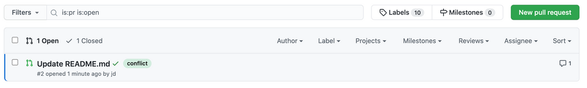

.. meta::
   :description: Mergify Documentation for Label Action
   :keywords: mergify, label, pull request
   :summary: Add or remove a label from a pull request.
   :doc:icon: tag

.. _label action:

label
=====

The ``label`` action can add or remove `labels
<https://docs.github.com/en/issues/using-labels-and-milestones-to-track-work/managing-labels>`_ from a pull request.

Options
-------

.. list-table::
   :header-rows: 1
   :widths: 1 1 1 3

   * - Key Name
     - Value Type
     - Default
     - Value Description
   * - ``add``
     - list of :ref:`data type template`
     - ``[]``
     - The list of labels to add.
   * - ``remove``
     - list of :ref:`data type template`
     - ``[]``
     - The list of labels to remove.
   * - ``remove_all``
     - Boolean
     - ``false``
     - Remove all labels from the pull request.
   * - ``toggle``
     - list of :ref:`data type template`
     - ``[]``
     - Toggle labels in the list based on the conditions. If all the conditions are a success, all the labels in the list will be added, otherwise, they will all be removed.

Examples
--------

💥 Warn on Conflicts
~~~~~~~~~~~~~~~~~~~~

When browsing the list of pull request, GitHub does not give any indication on
which pull requests might be in conflict. Mergify allows to do this easily by
adding a label.

.. code-block:: yaml

    pull_request_rules:
      - name: warn on conflicts
        conditions:
          - conflict
        actions:
          comment:
            message: "@{{author}} this pull request is now in conflict 😩"
          label:
            add:
              - conflict
      - name: remove conflict label if not needed
        conditions:
          - -conflict
        actions:
          label:
            remove:
              - conflict

Then, you pull request list will look like this on conflict:

Toggle a label based on CI status
~~~~~~~~~~~~~~~~~~~~~~~~~~~~~~~~~

.. code-block:: yaml

    pull_request_rules:
      - name: toggle labels based on CI state
        conditions:
          - check-failure=CI
        actions:
          label:
            toggle:
              - "CI:fail"

Add a label based on the name of the branch
~~~~~~~~~~~~~~~~~~~~~~~~~~~~~~~~~~~~~~~~~~~

.. code-block:: yaml

    pull_request_rules:
      - name: add a label with the name of the branch
        conditions: []
        actions:
          label:
            add:
              - "branch:{{base}}"
