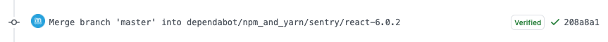

.. meta::
   :description: Mergify Documentation for Update Action
   :keywords: mergify, update, merge, master, main, pull request
   :summary: Update a pull request with its base branch.
   :doc:icon: arrow-alt-circle-right

.. _update action:

update
======

The ``update`` action updates the pull request against its base branch. It
works by merging the base branch into the head branch of the pull request.

.. tip::

   You do not need to use this action if you use the :ref:`queue action page`
   action. The merge queue automatically update the pull requests it processes
   as necessary, making sure they are test with up-to-date code before being
   merged.

Options
-------

.. list-table::
   :header-rows: 1
   :widths: 1 1 1 3

   * - Key Name
     - Value Type
     - Default
     - Value Description
   * - ``bot_account``
     - :ref:`data type template`
     -
     - Mergify can impersonate a GitHub user to update a pull request.
       If no ``bot_account`` is set, Mergify will update the pull request
       itself.

Examples
--------

.. _example linear history:

↑ Linear History
~~~~~~~~~~~~~~~~~

As GitHub supports linear history in pull request settings, it is very handy to
use a rule to keep your pull requests up-to-date. As you do not want to trigger
your CI too often by always re-running it on every pull request — especially
when there is still work in progress — you can limit this action to labeled
pull requests.

.. code-block:: yaml

    pull_request_rules:
      - name: automatic update for PR marked as “Ready-to-Go“
        conditions:
          - -conflict # skip PRs with conflicts
          - -draft # filter-out GH draft PRs
          - label="Ready-to-Go"
        actions:
          update:

When a pull request is not in conflict nor draft, and has the label
``Ready-to-Go``, it will be automatically updated with its base branch.

.. include:: ../global-substitutions.rst
