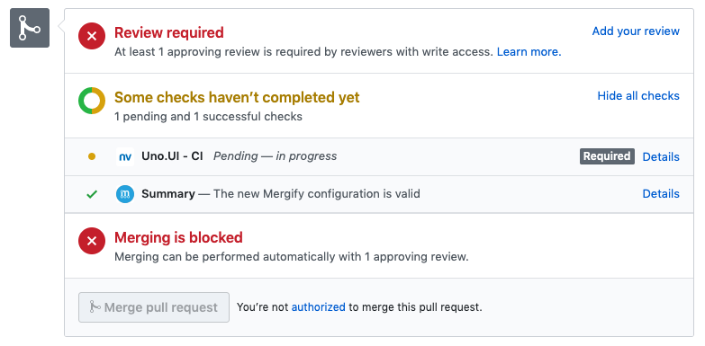
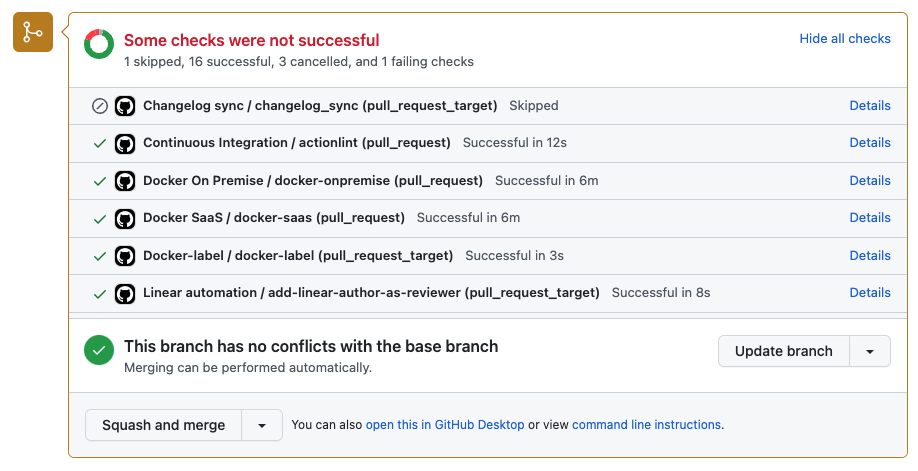
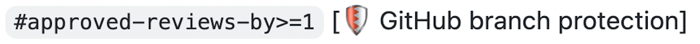

.. meta::
   :description: Mergify Documentation for Conditions
   :keywords: mergify, conditions

.. _Conditions:

=============
🎯 Conditions
=============

Conditions are used in pull request rules and queue rules to check if a pull
request matches a certain rule. If a pull request matches all of the listed
conditions in a rule, the subsequent actions listed in that rule will be
applied. Conditions must be listed under the ``conditions`` section of the
``pull_request_rules`` entry or the ``merge_conditions`` section of the ``queue_rules``
entry — see :ref:`configuration file format`.

Grammar
~~~~~~~

A condition is a string that has the following format::

  [ "-" ] [ "#" ] <attribute> [ <operator> <value> ]

- The optional ``-`` prefix is equivalent to the `not` operator.

- The optional ``#`` prefix indicates to consider the length of the attribute
  value rather than its content.

- An ``attribute`` is a property of a pull request, such as its author, its
  title or its base branch.

- An ``operator`` is used to determine how the match between the pull request's
  ``attribute`` and the defined ``value`` occurs.

- A ``value`` can be a simple expression to match with the pull request's
  ``attribute``, or a :ref:`data type template` for more complex use cases.

For example:

- ``author=jd`` evaluates to true if the GitHub login of the author of the pull
  request is ``jd``.

- ``base~=^stable/`` matches any pull request whose base branch matches the
  regular expression ``^stable/``.

- ``approved-reviews-by=sileht`` matches if the user ``sileht`` is in the list
  of contributors who approved the pull request.

- ``#approved-reviews-by>=2`` matches if at least 2 collaborators approved the
  pull request.

- ``-merged`` matches if the pull requested has not been merged.

- ``sender={{ author }}`` evaluates to true if the GitHub login of the sender of
  the command is the author of the pull request.

.. important::

   The ``#`` character is considered as a comment delimiter in YAML. As ``#``
   is the length operator in Mergify's conditions system, don't forget to use
   ``"`` around the condition to write valid YAML syntax.

.. note::

  ``operator`` and ``value`` are only optional if the ``attribute`` type is
  ``Boolean``.

Combining Conditions with Operators
~~~~~~~~~~~~~~~~~~~~~~~~~~~~~~~~~~~

The `conditions` do support the ``or``, ``and`` and ``not`` operators.

For example, you can match if its author is ``foo`` or
``bar``, you could write:

.. code-block:: yaml

    conditions:
      - or:
        - author=foo
        - author=bar

Or you can do the opposite with the ``not`` operator:

.. code-block:: yaml

    conditions:
      - not:
          or:
            - author=foo
            - author=bar

You can also combine ``or`` and ``and`` like this:

.. code-block:: yaml

    conditions:
      - or:
        - and:
            - author=foo
            - label=core
        - and:
            - author=bar
            - label=backend

.. note::

    The depth on combined conditions is limited to 8.

.. _attributes:

Attributes
~~~~~~~~~~

Here's the list of pull request attribute that can be used in conditions:

.. list-table::
   :header-rows: 1
   :widths: 1 1 2

   * - Attribute Name
     - Value type
     - Value description
   * - ``approved-reviews-by``
     - list of string
     - The list of GitHub user or team login that approved the pull request.
       Team logins are prefixed with the ``@`` character and must belong to the
       repository organization.
       This only matches reviewers with ``admin``, ``write`` or ``maintain``
       permission on the repository.
   * - ``assignees``
     - list of string
     - The list of GitHub user or team login that are assigned to the pull request.
       Team logins are prefixed with the ``@`` character and must belong to the
       repository organization.
   * - ``author``
     - string
     - The GitHub user or team login of the author of the pull request.
       Team logins are prefixed with the ``@`` character and must belong to the
       repository organization.
   * - ``base``
     - string
     - The name of the branch the pull request should be pulled into.
   * - ``body``
     - string
     - The contents of the pull request description without Markdown/HTML comments.
   * - ``body-raw``
     - string
     - The contents of the pull request description.
   * - ``branch-protection-review-decision``
     - string
     - The review decision, could be one of ``APPROVED``, ``CHANGES_REQUESTED``
       or ``REVIEW_REQUIRED``.
       This indicates if `CODEOWNERS
       <https://docs.github.com/en/repositories/managing-your-repositorys-settings-and-features/customizing-your-repository/about-code-owners>`_
       have reviewed the pull request when the `Require review from Code Owners`
       branch protection rule is enabled.
   * - ``changes-requested-reviews-by``
     - list of string
     - The list of GitHub user or team login that have requested changes in a
       review for the pull request.
       Team logins are prefixed with the ``@`` character and must belong to the
       repository organization.
       This only matches reviewers with ``admin``, ``write`` or ``maintain``
       permission on the repository.
   * - ``check-failure``
     - list of string
     - The list of status checks that failed for the pull request.
       This is the name of a *status check* such as
       `continuous-integration/travis-ci/pr` or of a *check run* such as
       `Travis CI - Pull Request`. See `About Status Checks`_ for more
       details.
       Checks that report being cancelled, timed out, and action
       required are also considered as failures.
   * - ``check-neutral``
     - list of string
     - The list of status checks that are neutral for the pull request.
       This is the name of a *status check* such as
       `continuous-integration/travis-ci/pr` or of a *check run* such as
       `Travis CI - Pull Request`. See `About Status Checks`_ for more
       details.
   * - ``check-pending``
     - list of string
     - The list of status checks that is pending for the pull request.
       This is the name of a *status check* such as
       `continuous-integration/travis-ci/pr` or of a *check run* such as
       `Travis CI - Pull Request`. See `About Status Checks`_ for more
       details.
   * - ``check-skipped``
     - list of string
     - The list of status checks that was skipped for the pull request.
       This is the name of a *status check* such as
       `continuous-integration/travis-ci/pr` or of a *check run* such as
       `Travis CI - Pull Request`. See `About Status Checks`_ for more
       details.
   * - ``check-stale``
     - list of string
     - The list of status checks that are stale for the pull request.
       This is the name of a *status check* such as
       `continuous-integration/travis-ci/pr` or of a *check run* such as
       `Travis CI - Pull Request`. See `About Status Checks`_ for more
       details.
   * - ``check-success``
     - list of string
     - The list of status checks that successfully passed for the pull request.
       This is the name of a *status check* such as
       `continuous-integration/travis-ci/pr` or of a *check run* such as
       `Travis CI - Pull Request`. See `About Status Checks`_ for more
       details.
   * - ``check-timed-out``
     - list of string
     - The list of status checks that timed out for the pull request.
       This is the name of a *status check* such as
       `continuous-integration/travis-ci/pr` or of a *check run* such as
       `Travis CI - Pull Request`. See `About Status Checks`_ for more
       details.
   * - ``closed``
     - Boolean
     - Whether the pull request is closed.
   * - ``closed-at``
     - :ref:`Timestamp <iso timestamp>` or :ref:`Relative timestamp <relative timestamp>`
     - The time the pull request was closed at.
   * - ``commented-reviews-by``
     - list of string
     - The list of GitHub user or team login that have commented in a review
       for the pull request.
       Team logins are prefixed with the ``@`` character and must belong to the
       repository organization.
       This only matches reviewers with ``admin``, ``write`` or ``maintain``
       permission on the repository.
   * - ``co-authors``
     - list of :ref:`authors <data type commit author>`
     - The list of co-authors on the pull request.
   * - ``commits``
     - list of :ref:`commits <data type commit>`
     - The list of commits of the pull request. The index ``0`` is the first
       commit of the pull request, while ``-1`` is the last commit of the pull
       request.
   * - ``commits[X].author``
     - string
     - The name of the author of the ``Xth`` commit.
   * - ``commits[X].commit_message``
     - string
     - The commit message of the ``Xth`` commit.
   * - ``commits[X].commit_verification_verified``
     - Boolean
     - Whether GitHub considers the signature of the ``Xth`` commit to be verified.
   * - ``commits[X].committer``
     - string
     - The name of the committer of the ``Xth`` commit.
   * - ``commits[X].date_author``
     - :ref:`Timestamp <iso timestamp>` or :ref:`Relative timestamp <relative timestamp>`
     - The author date of the ``Xth`` commit.
   * - ``commits[X].date_committer``
     - :ref:`Timestamp <iso timestamp>` or :ref:`Relative timestamp <relative timestamp>`
     - The committer date of the ``Xth`` commit.
   * - ``commits[X].email_author``
     - string
     - The ``Xth`` commit's author's email.
   * - ``commits[X].email_committer``
     - string
     - The ``Xth`` commit's committer's email.
   * - ``commits[*].author``
     - list of string
     - The list of names of the authors of each commits.
   * - ``commits[*].commit_message``
     - list of string
     - The list of commit message of each commits.
   * - ``commits[*].commit_verification_verified``
     - list of Boolean
     - Whether GitHub considers the signature of each commits to be verified.
   * - ``commits[*].committer``
     - list of string
     - The names of the committers of each commits.
   * - ``commits[*].date_author``
     - list of :ref:`Timestamp <iso timestamp>` or list of :ref:`Relative timestamp <relative timestamp>`
     - The list of author dates of each commits.
   * - ``commits[*].date_committer``
     - list of :ref:`Timestamp <iso timestamp>` or list of :ref:`Relative timestamp <relative timestamp>`
     - The list of committer dates of each commits.
   * - ``commits[*].email_author``
     - list of string
     - The authors' emails of each commits.
   * - ``commits[*].email_committer``
     - list of string
     - The list of all commits' committer's email.
   * - ``commits-behind``
     - list of commits
     - The list of commits between the head of the base branch and the base of
       the pull request. This can only be used with the length operator as
       `#commits-behind`.
   * - ``commits-unverified``
     - list of strings
     - The list of commit messages that are marked as ``unverified`` by GitHub.
   * - ``conflict``
     - Boolean
     - Whether the pull request is conflicting with its base branch.
   * - ``created-at``
     - :ref:`Timestamp <iso timestamp>` or :ref:`Relative timestamp <relative timestamp>`
     - The time the pull request was created at.
   * - ``dependabot-dependency-name``
     - string
     - The dependency-name value included in the Dependabot commit message.
   * - ``dependabot-dependency-type``
     - string
     - The dependency-type value included in the Dependabot commit message.
   * - ``dependabot-update-type``
     - string
     - The update-type value included in the Dependabot commit message.
   * - ``dismissed-reviews-by``
     - list of string
     - The list of GitHub user or team login that have their review dismissed
       in the pull request.
       Team logins are prefixed with the ``@`` character and must belong to the
       repository organization.
       This only matches reviewers with ``admin``, ``write`` or ``maintain``
       permission on the repository.
   * - ``draft``
     - Boolean
     - Whether the pull request is in draft state.
   * - ``files``
     - list of string
     - The files that are modified, deleted or added by the pull request.
   * - ``head``
     - string
     - The name of the branch where the pull request changes are implemented.
   * - ``label``
     - list of string
     - The list of labels of the pull request.
   * - ``linear-history``
     - Boolean
     - Whether the pull request commits history is linear (no merge commit).
   * - ``locked``
     - Boolean
     - Whether the pull request is locked.
   * - ``merged``
     - Boolean
     - Whether the pull request is merged. This attribute doesn't work on
       pull requests merged before a rule using this attribute is created.
   * - ``merged-at``
     - :ref:`Timestamp <iso timestamp>` or :ref:`Relative timestamp <relative timestamp>`
     - The time the pull request was merged at.
   * - ``merged-by``
     - string
     - The GitHub user or team login that merged the pull request.
       Team logins are prefixed with the ``@`` character and must belong to the
       repository organization.
   * - ``milestone``
     - string
     - The milestone title associated to the pull request.
   * - ``number``
     - integer
     - The pull request number.
   * - ``queue-partition-name``
     - list of string
     - The name of the partitions the pull request is queued in.
   * - ``queue-position``
     - integer
     - | The position of the pull request in its queue if queued.
       | The first pull request in the queue has position ``0``.
       | The value is set to ``-1`` if the pull request is not queued.
       | NB: If you are using partitions, this condition returns the maximum position of the pull request from all the partitions it is queued in.
   * - ``queued-at``
     - :ref:`Timestamp <iso timestamp>` or :ref:`Relative timestamp <relative timestamp>`
     - The time the pull request was queued at for merge.
   * - ``queue-merge-started-at``
     - :ref:`Timestamp <iso timestamp>` or :ref:`Relative timestamp <relative timestamp>`
     - | The time the pull request mergeability checks have started at.
       | NB: This attribute does not work when using :ref:`partition rules`.
   * - ``repository-full-name``
     - string
     - The current repository full name (complete version with the organization name).
   * - ``repository-name``
     - string
     - The current repository name (short version without the organization name).
   * - ``review-requested``
     - list of string
     - The list of GitHub user or team login that were requested to review the
       pull request.
       Team logins are prefixed with the ``@`` character and must belong to the
       repository organization.
       This only matches reviewers with ``admin``, ``write`` or ``maintain``
       permission on the repository.
   * - ``review-threads-resolved``
     - list of strings
     - The list of bodies associated to review threads that are marked as ``resolved`` by GitHub.
   * - ``review-threads-unresolved``
     - list of strings
     - The list of bodies associated to review threads that are NOT marked as ``resolved`` by GitHub.
   * - ``schedule``
     - :ref:`Schedule <schedule format>`
     - The current time will be compared against this schedule to un/validate this attribute.
   * - ``title``
     - string
     - The title of the pull request.
   * - ``updated-at``
     - :ref:`Timestamp <iso timestamp>` or :ref:`Relative timestamp <relative timestamp>`
     - The time the pull request was updated at.

Here's the list of pull request attribute only usable in :ref:`Commands Restrictions <commands restrictions>` conditions:

.. list-table::
   :header-rows: 1
   :widths: 1 1 2

   * - Attribute Name
     - Value type
     - Value description
   * - ``sender``
     - string
     - The GitHub user or team login of the sender of the GitHub event.
       Team logins are prefixed with the ``@`` character and must belong to the
       repository organization.
   * - ``sender-permission``
     - string
     - The permission of the sender of the GitHub event on the repository.
       Available permissions are ``admin``, ``write``, ``read`` or ``none``.

.. warning::

   Time-based conditions have a 5 minutes precision at best. Do not write
   conditions based on time ranges that are too narrow or the condition might
   never be true.

.. note::

   ``created-at``, ``updated-at``, ``closed-at`` and ``merged-at``
   do not support the ``~=``, ``=`` and ``!=`` operators.
   ``schedule`` only supports the ``=`` and ``!=`` operators.

.. note::

   ``schedule`` works only for open pull requests or pull requests closed in the last 7 days.

.. note::

   The timezone for all time-based conditions is UTC.

.. _Operators:

Operators
~~~~~~~~~

.. list-table::
   :header-rows: 1
   :widths: 2 1 3

   * - Operator Name
     - Symbol
     - Operator Description
   * - Equal
     - ``=`` or ``:``
     - This operator checks for strict equality. If the target attribute type
       is a list, each element of the list is compared against the value and
       the condition is true if any value matches.
   * - Not Equal
     - ``!=`` or ``≠``
     - This operator checks for non equality. If the target attribute type
       is a list, each element of the list is compared against the value and
       the condition is true if no value matches.
   * - Match
     - ``~=``
     - This operator checks for :ref:`regular expressions <regular
       expressions>` matching. If the target attribute type is a list, each
       element of the list is matched against the value and the condition is
       true if any value matches.
   * - Greater Than or Equal
     - ``>=`` or ``≥``
     - This operator checks for the value to be greater than or equal to the
       provided value. It's usually used to compare against the length of a
       list using the ``#`` prefix.
   * - Greater Than
     - ``>``
     - This operator checks for the value to be greater than the provided
       value. It's usually used to compare against the length of a list using
       the ``#`` prefix.
   * - Lesser Than or Equal
     - ``<=`` or ``≤``
     - This operator checks for the value to be lesser then or equal to the
       provided value. It's usually used to compare against the length of a
       list using the ``#`` prefix.
   * - Lesser Than
     - ``<``
     - This operator checks for the value to be lesser than the provided value.
       It's usually used to compare against the length of a list using the
       ``#`` prefix.

How To Match Lists
~~~~~~~~~~~~~~~~~~~

Some attributes have a type of ``list``. Most `Operators`_ are able to match
value against lists: they will iterate over all the values of the list and
return true if **any** of the value matches.

For example, the ``label`` attribute is a list of string containing the names
of the label attached to a pull request. With a pull request whose labels are
``(bug, work-in-progress)``, then:

- ``label=work-in-progress`` is **true** because there is a label named
  ``work-in-progress``.

- ``label=enhancement`` is **false** because there is no label named
  ``enhancement``.

- ``label!=work-in-progress`` is **false** because there is a label named
  ``work-in-progress``.

- ``label~=^work`` is **true** because there is a label matching the regular
  expression ``^work``.

- ``-label~=^work`` is **false** because there is a label matching the regular
  expression ``^work`` but the condition is reversed with the ``-`` prefix.

The same applies for the ``files`` attribute — which contains the list of
modified files:

- ``files=README`` is **true** if the file ``README`` is modified in the pull
  request.

- ``files!=README`` is **true** if the file ``README`` is not modified in the
  pull request.

- ``files~=^src/`` is **true** if any files in the ``src`` directory is
  modified in the pull request.

- ``-files~=^src/`` is **true** if none of the files that are modified are in
  the ``src`` directory.

- ``files~=^(README.md|CONTRIBUTING.md)$`` is **true** if the file
  ``README.md`` **or** ``CONTRIBUTING.md`` is modified in the pull requests.

About Status Checks
~~~~~~~~~~~~~~~~~~~

Generic Status Check
++++++++++++++++++++

When using the ``check-success``, ``check-neutral``, ``check-failure``,
``check-skipped``, ``check-pending``, and ``check-stale``
conditions, you need to use the name of your check service. This can be find by
opening an existing pull request and scrolling down near the ``Merge`` button.

The name of the status check is written in bold on the left side. In the
example above, it should be ``Uno.UI - CI``. A condition that would make sure
this checks succeed before doing any action should be written as:

.. code-block:: yaml

     conditions:
       - check-success=Uno.UI - CI

GitHub Actions
++++++++++++++

GitHub Actions works slightly differently. To match a status check when using
GitHub Action, only the job name is used (not the workflow name).

In the example above, to validate the listed jobs:

.. code-block:: yaml

     conditions:
       - check-success=changelog_sync
       - check-success=actionlint
       - check-success=docker-onpremise
       - check-success=docker-saas
       - check-success=docker-label
       - check-success=add-linear-author-as-reviewer

Validating All Status Checks
++++++++++++++++++++++++++++

A common condition is to require that "every status check (CI) passes" —
especially before executing the :ref:`merge action` action.

**There is no such thing as "every status check" in GitHub.**

Here's why:

1. Each pull request can have its own custom list of status checks.
2. On creation, or when a new commit is pushed, a pull request has **no**
   status check.
3. A status check might not be reported by a service (CI) (e.g., because it's
   broken) and therefore be absent.

Those three facts make it **mandatory** to write explicitly the checks that are
expected for your condition to be valid. Therefore you must list explicitly
every status check that is expected, e.g.:

.. code-block:: yaml

     conditions:
       - check-success=build: Windows
       - check-success=build: Linux

**Do not** use conditions such as:

- ``#check-failure=0``, because this will be true as soon as the pull request is
  created and before any service report its status (see point 2. above).

- ``check-success~=build`` while expecting this to wait for "all" status checks
  that have ``build`` in their name (see point 1. and 2.above).

Such conditions won't do what you want them to do.

About Branch Protection
~~~~~~~~~~~~~~~~~~~~~~~

GitHub allows you to enable branch protection settings on your repository.
For some of the branch protection parameters, listed below, Mergify is going to generate
corresponding conditions in pull request and queue rules:

- ``Require a pull request before merging`` with ``Require approvals``

- ``Require status checks to pass before merging``

- ``Require conversation resolution before merging``

Thus, enabling ``Require a pull request before merging`` and
``Require approvals`` will set the following condition:

.. code-block:: yaml

     conditions:
       - "#approved-reviews-by>=1"
       - "#changes-requested-reviews-by=0"

Enabling ``Require status checks to pass before merging`` will set the
following condition **for each** checks in your repository:

.. code-block:: yaml

     conditions:
        - and:
          - or:
            - check-success=continuous-integration/travis-ci
            - check-neutral=continuous-integration/travis-ci
            - check-skipped=continuous-integration/travis-ci
          - or:
            - check-success=continuous-integration/circle-ci
            - check-neutral=continuous-integration/circle-ci
            - check-skipped=continuous-integration/circle-ci

            ...

Enabling ``Require conversation resolution before merging`` will set the
following condition:

.. code-block:: yaml

     conditions:
       - "#review-threads-unresolved=0"

Each condition generated by the branch protection settings will be tagged with
a description note in order to notify its provenance.

.. include:: global-substitutions.rst
